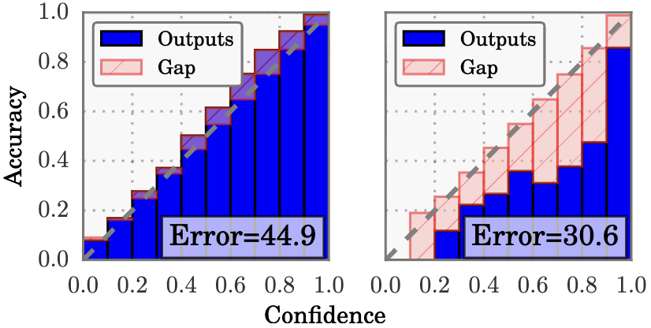
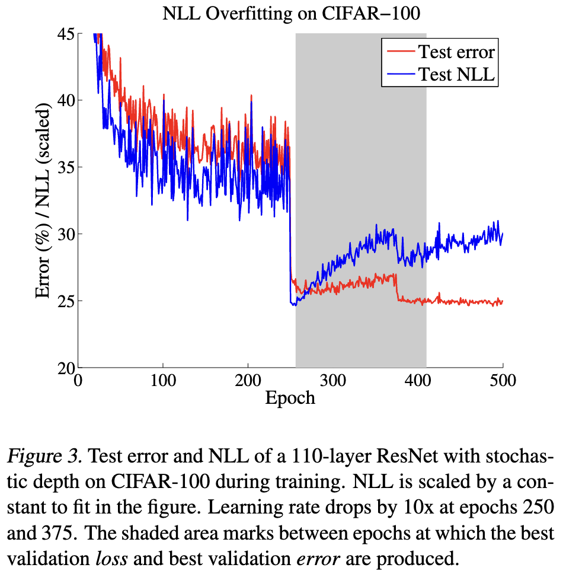

# Calibration

## On Calibration of Modern Neural Networks (ICML, 2017)

https://fernandoperezc.github.io/Advanced-Topics-in-Machine-Learning-and-Data-Science/Fluri.pdf
https://proceedings.mlr.press/v70/guo17a.html

### Perfect calibration

Let $h$ be a neural network with $h(X) = (\hat{Y}, \hat{P})$, where $\hat{Y}$ is the class prediction and $\hat{P}$ is its associated confidence.

We define perfect calibration as:
$$
\Pr(\hat{Y} = Y \mid \hat{P} = p) = p, \quad \forall p \in [0,1]
$$

For a well-calibrated neural network, the probability associated with the predicted label (average confidence) is similar to the average accuracy. 

#### Reliability Diagram

Plot sample accuracy as a function of confidence. Perfect calibrated diagram plots identity function. 

Let $B_m$ be set of indices of samples whose prediction confidence falls into interval $I_m = (\frac{m-1}{M}, \frac{m}{M}]$. 

The **average accuracy** of $B_m$ is $\mathrm{acc}(B_m) = \frac{1}{\lvert B_m \rvert} \sum_{i\in B_m} \mathbb{I}(\hat{y}_i = y_i)$

The **average confidence** within $B_m$ is $\mathrm{conf}(B_m) = \frac{1}{\lvert B_m \rvert} \sum_{i\in B_m} \hat{p}_i$. $\hat{p}_i$ is the confidence for sample $i$.

Perfect calibrated model would have $\mathrm{acc}(B_m) = \mathrm{conf}(B_m)$

### Model calibration

Difference in expectation between confidence and accuray is one scalar summary of miscalibration.

$$
\mathbb{E}\left[ \lvert \Pr(\hat{Y} = Y \mid \hat{P} = p) - p \rvert \right]
$$

#### ECE

Expected calibrated error approximate the above.

$$
\mathrm{ECE} = \sum_{m=1}^M \frac{\lvert B_m \rvert}{n} \lvert \mathrm{acc}(B_m) - \mathrm{conf}(B_m) \rvert
$$

#### MCE

Maximum calibrated error. An upper bound of the deviationle="width:42px"

$$
\mathrm{MCE} = \max_{m=1}^M \lvert \mathrm{acc}(B_m) - \mathrm{conf}(B_m) \rvert
$$

The classification networks must not only be accurate but also indicate when they are likely to be incorrect. A network should provide a _calibrated confidence_ measure in addition to prediction.

### Observing miscalibration

- model capacity
- lack of regularization

#### NLL

Negative log likelihood: 

_neural network can overfit to NLL w/o overfitting to 0/1 loss_

!!! note
    Before epoch 250 — large learning rate. The optimizer takes big steps. Near the bottom of the basin, big steps overshoot: the parameters jump past the minimum, land on the other side, jump back, and keep oscillating around the basin without settling into it. The loss can't get below a floor set by how big those jumps are. This is why both error and NLL plateau for a stretch — not because the model has learned all it can, but because the **steps are too coarse** to make fine progress.
    
    At epoch 250 — learning rate dropped (typically ×0.1). Suddenly the steps are ~10× smaller. Now the ball stops bouncing over the fine structure and actually settles into the basin. The oscillation damps out, the optimizer can exploit the local curvature, and the loss drops to a much lower floor almost immediately. Because better-fit weights mean both lower loss and sharper, more correct decisions, NLL and error fall together.

[Understanding deep learning requires rethinking generalization](https://arxiv.org/abs/1611.03530)

### Tempaerature scaling

