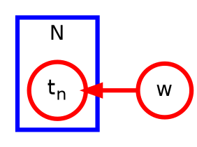
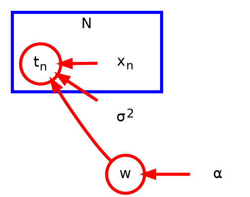

# Graphical Model

- [ ] 8.1. Bayesian Networks

A graph comprises **nodes** (also called vertices) connected by **links** (also known as edges or arcs). 

In a probabilistic graphical model, each node represents a random variable (or group of random variables), and the links express probabilistic relationships between these variables.

- Bayesian networks (directed graphical models)
- Markov random fields (undirected graphical models)
- factor graph

### Factorization properties of the joint distribution for a directed graphical model

$$
\begin{aligned}
p(x_1, \ldots, x_n) &= \prod_{i=1}^n p(x_i \mid \mathrm{pa}(x_i)) \\
&= p(x_n \mid x_1, \ldots, x_{n-1}) \ldots p(x_2 \mid x_1) p(x_1)
\end{aligned}
$$

$\mathrm{pa}(x_i)$ denotes the set of parents of $x_i$

??? note "Tip"
    <h3>Drawing graphical models</h3>

    For this MkDocs site, use Graphviz/DOT for graphical models. It supports reusable node and edge defaults and plate-style clusters.

    <h4>Bayesian network</h4>

    ```graphviz
    digraph G {
      rankdir=LR;

      node [shape=circle, style=filled, fillcolor=white];

      Cloudy -> Sprinkler;
      Cloudy -> Rain;
      Sprinkler -> WetGrass;
      Rain -> WetGrass;
    }
    ```

    This represents the factorization

    $$
    p(C, S, R, W) = p(C)p(S \mid C)p(R \mid C)p(W \mid S, R).
    $$

The **absence** of links in the graph that conveys interesting information about the properties of the class of distributions that the graph represents.

??? note "8.3"
    $$p(a=1, b=1 \mid c=1) = 0.1846154$$

    $$p(a=1 \mid c=1) = 0.3076923$$

    $$p(b=1 \mid c=1) = 0.6$$

### Example

Make predictions for the target variable $t$ given some new value of the input variable $x$ on the basis of a set of training data comprising $N$ input values $\mathbf{x} = (x_1, \ldots, x_N)^T$ and their corresponding target values $\mathbf{t} = (t_1, \ldots, t_N)^T$. In math, we wish to evaluate $p(t \mid x, \mathbf{x}, \mathbf{t})$

log liklihood is 

$$
\ln p(\mathbf{t} \mid \mathbf{x}, {\color{red}\mathbf{w}}, \beta)
=
-\frac{\beta}{2}
{\color{blue}\sum_{n=1}^{N}
\left\{ y(x_n, \mathbf{w}) - t_n \right\}^2}
+
\frac{N}{2}\ln \beta
-
\frac{N}{2}\ln(2\pi).
$$

we **maximizing** the log liklihood (MLE) w.r.t. ${\color{red}\mathbf{w}}$

maximizing likelihood is equivalent, so far as determining $\mathbf{w}$ is concerned, to minimizing the sum-of-squares error function. 

Thus the sum-of-squares error function has arisen as a consequence of maximizing likelihood under the assumption of a Gaussian noise distribution.

Let's introduce a prior distribution over $w$. Consider a Gaussian distribution (for simplicity)

$$
p(\mathbf{w} \mid \alpha)
=
\mathcal{N}(\mathbf{w} \mid \mathbf{0}, \alpha^{-1}\mathbf{I})
=
\left( \frac{\alpha}{2\pi} \right)^{(M+1)/2}
\exp
\left\{
-\frac{\alpha}{2}\mathbf{w}^{\mathrm{T}}\mathbf{w}
\right\}
$$

Then as $p(\mathbf{w} \mid \mathbf{x}, \mathbf{t}, \alpha, \beta) \propto p(\mathbf{t} \mid \mathbf{x}, \mathbf{w}, \beta) p(\mathbf{w} \mid \alpha)$

Minimize $p(\mathbf{w} \mid \mathbf{x}, \mathbf{t}, \alpha, \beta)$ is equivalent to minimizing $\frac{\beta}{2} \sum_{n=1}^{N} \left\{ y(x_n, \mathbf{w}) - t_n \right\}^2 + \frac{\alpha}{2} \mathbf{w}^{\mathrm{T}}\mathbf{w}$

**plate**: box surrounding a single representative node



- random variable denoted by open circles
- deterministic parameters denoted by smaller solid circles


