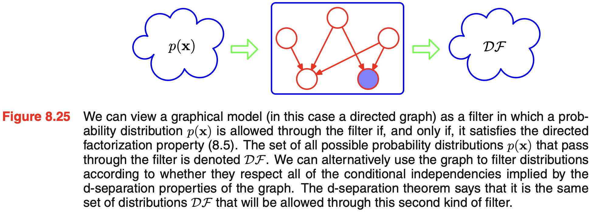
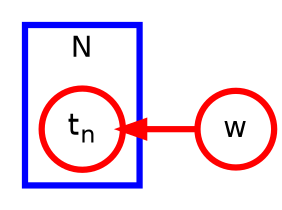
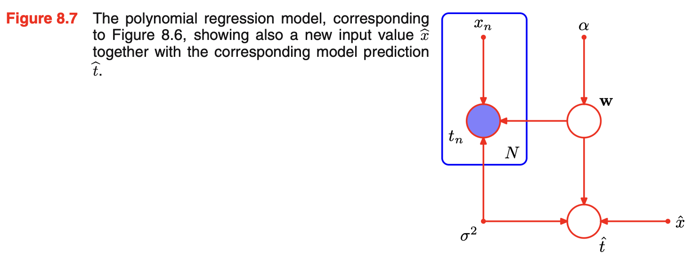
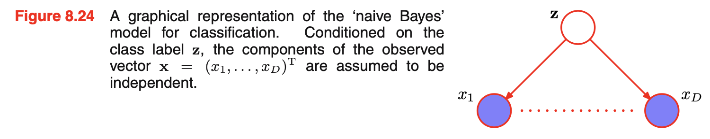
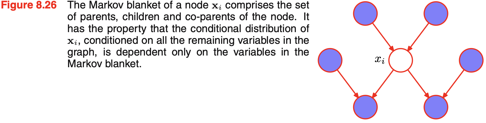

# Graphical Model

- [X] 8.1. Bayesian Networks
- [ ] 8.1.2 Generative models

A graph comprises **nodes** (also called vertices) connected by **links** (also known as edges or arcs). 

In a probabilistic graphical model, each node represents a random variable (or group of random variables), and the links express probabilistic relationships between these variables.

- Bayesian networks (directed graphical models)
- Markov random fields (undirected graphical models)
- factor graph

### Factorization properties of the joint distribution for a directed graphical model

$$
\begin{aligned}
p(x_1, \ldots, x_n) &= \prod_{i=1}^n p(x_i \mid \mathrm{pa}(x_i)) \\
&= p(x_n \mid x_1, \ldots, x_{n-1}) \ldots p(x_2 \mid x_1) p(x_1)
\end{aligned}
$$

$\mathrm{pa}(x_i)$ denotes the set of parents of $x_i$

We call this **directed factorization property**. A graph describes a set of conditional independence properties.



the set of distributions $\mathcal{DF}$ will include any distributions that have **additional** independence properties beyond those described by the graph.

The more independence properties a distributions has, the harder it get filtered out.

??? note "Tip"
    <h3>Drawing graphical models</h3>

    For this MkDocs site, use Graphviz/DOT for graphical models. It supports reusable node and edge defaults and plate-style clusters.

    <h4>Bayesian network</h4>

    ```graphviz
    digraph G {
      rankdir=LR;

      node [shape=circle, style=filled, fillcolor=white];

      Cloudy -> Sprinkler;
      Cloudy -> Rain;
      Sprinkler -> WetGrass;
      Rain -> WetGrass;
    }
    ```

    This represents the factorization

    $$
    p(C, S, R, W) = p(C)p(S \mid C)p(R \mid C)p(W \mid S, R).
    $$

The **absence** of links in the graph that conveys interesting information about the properties of the class of distributions that the graph represents.

??? note "8.3"
    $$p(a=1, b=1 \mid c=1) = 0.1846154$$

    $$p(a=1 \mid c=1) = 0.3076923$$

    $$p(b=1 \mid c=1) = 0.6$$

### Example

Make predictions for the target variable $t$ given some new value of the input variable $x$ on the basis of a set of training data comprising $N$ input values $\mathbf{x} = (x_1, \ldots, x_N)^T$ and their corresponding target values $\mathbf{t} = (t_1, \ldots, t_N)^T$. In math, we wish to evaluate $p(t \mid x, \mathbf{x}, \mathbf{t})$

log liklihood is 

$$
\ln p(\mathbf{t} \mid \mathbf{x}, {\color{red}\mathbf{w}}, \beta)
=
-\frac{\beta}{2}
{\color{blue}\sum_{n=1}^{N}
\left\{ y(x_n, \mathbf{w}) - t_n \right\}^2}
+
\frac{N}{2}\ln \beta
-
\frac{N}{2}\ln(2\pi).
$$

we **maximizing** the log liklihood (MLE) w.r.t. ${\color{red}\mathbf{w}}$

maximizing likelihood is equivalent, so far as determining $\mathbf{w}$ is concerned, to minimizing the sum-of-squares error function. 

Thus the sum-of-squares error function has arisen as a consequence of maximizing likelihood under the assumption of a Gaussian noise distribution.

Let's introduce a prior distribution over $w$. Consider a Gaussian distribution (for simplicity)

$$
p(\mathbf{w} \mid \alpha)
=
\mathcal{N}(\mathbf{w} \mid \mathbf{0}, \alpha^{-1}\mathbf{I})
=
\left( \frac{\alpha}{2\pi} \right)^{(M+1)/2}
\exp
\left\{
-\frac{\alpha}{2}\mathbf{w}^{\mathrm{T}}\mathbf{w}
\right\}
$$

Then as $p(\mathbf{w} \mid \mathbf{x}, \mathbf{t}, \alpha, \beta) \propto p(\mathbf{t} \mid \mathbf{x}, \mathbf{w}, \beta) p(\mathbf{w} \mid \alpha)$

Minimize $p(\mathbf{w} \mid \mathbf{x}, \mathbf{t}, \alpha, \beta)$ is equivalent to minimizing $\frac{\beta}{2} \sum_{n=1}^{N} \left\{ y(x_n, \mathbf{w}) - t_n \right\}^2 + \frac{\alpha}{2} \mathbf{w}^{\mathrm{T}}\mathbf{w}$

**plate**: box surrounding a single representative node



- random variable denoted by open circles
- deterministic parameters denoted by smaller solid circles



**ancestral sampling**: a way to generate samples from a probabilistic graphical model by sampling variables in causal/topological order: parents first, children later.

**generative models**: graphical models that capture the _causal process_

### Discrete Variables

$$
p(x \mid \mu) = \prod_{k=1}^K \mu_k^{x_k}
$$

here $\mathbf{x} = (x_1, x_2, \dots, x_K)$

where

$$
x_k =
\begin{cases}
1, & \text{if } \mathbf{x} \text{ is in state } k, \\
0, & \text{otherwise.}
\end{cases}
$$

For arbitary joint distribution over $M$ variables (each of which has $K$ states), the parameters that must be specified is $K^M-1$.

If all $M$ variables are independent, the total number of parameters would be $M(K-1)$.

Readers can see that we trade parameters for restricted class of distributions.

!!! info "Number of parameters"
    how to reduce number of independent parameters: 
    
    sharing parameters + restrict distribution + use parameterized models for the conditional distributions

### Linear-Gaussian models

Consider an arbitrary directed acyclic graph over D variables in which node $i$ represents a single continuous random variable $x_i$ having a Gaussian distribution. The mean of this distribution is taken to be a linear combination of the states of its parent nodes $pa_i$ of node $i$.

$$
p(x_i \mid \mathrm{pa}_i) = \mathcal{N}\left(x_i \;\middle|\; \sum_{j \in\mathrm{pa}_i} w_{ij} x_j + b_i, v_i\right)
$$

Thus by product rule

\begin{aligned}
\ln p(\mathbf{x}) 
&= \sum_{i=1}^{D} \ln p(x_i \mid \mathrm{pa}_i) \\
&= -\sum_{i=1}^{D} \frac{1}{2v_i}\left(x_i-\sum_{j \in \mathrm{pa}_i} w_{ij}x_j-b_i\right)^2+ \mathrm{const}
\end{aligned}

Since $\mathbf{x} = (x_1, \ldots, x_D)$, $p(\mathbf{x})$ is a multivariate Gaussian.

Since $x_i$ conditioned on parents is a Gaussian distribution, we can express $x_i$ as

$$
x_i = \sum_{j \in \mathrm{pa}_i} w_{ij} x_j + b_i + \sqrt{v_i}\epsilon_i
$$

Recursive expectation relation:

$$
\mathbb{E}[x_i] = \sum_{j \in \mathrm{pa}_i} {\color{red}w_{ij}} \mathbb{E}[x_j] + {\color{blue}b_i}
$$

Recursive covariance relation:

$$
\mathrm{cov}[x_i, x_j] = \sum_{k \in \mathrm{pa}_j} {\color{red}w_{jk}} \mathrm{cov}[x_i, x_k] + I_{ij}{\color{blue}v_j}
$$

a prior over hyperparameter: _hyperprior_

## Conditional Independence

a is conditionally independent of b given c

$$
a \perp \!\!\! \perp b \mid c
$$

equivalent to 

$$
p(a, b \mid c) = {\color{blue}p(a \mid b, c)}p(b \mid c) = {\color{blue}p(a \mid c)}p(b \mid c)
$$

## d-separation criteria

### tail-to-tail

### head-to-tail

observe $c$ "blocks" the path from $a$ to $b$

### head-to-head

conditioning induce a dependency

When node c is unobserved, it ‘blocks’ the path, and the variables a and b are independent. However, conditioning on c ‘unblocks’ the path and renders a and b dependent.

#### Naïve Bayes

Naïve bayes model is a graphical structure arises in an approach to classification. We use independence assumption to simplify the model structure.

Observed input is $\mathbf{x} = (x_1, \ldots, x_D)^T$ and we wish to classify it into $K$ classes. We represent these $K$ classes by 1-of-K encoding scheme (one-hot). 

We can define a generative model by introducing **a multinomial prior** $p(z \mid \mu)$ over the class labels, where kth component $\mu_k$ of $\mu$ is the prior probability of class $C_k$, together with a **conditional distribution** $p(\mathbf{x} \mid z)$ for observed vector $\mathbf{x}$

The key assumption is that conditioned on $z$, the distribution of $x_1, \ldots, x_D$ is independent. However, the marginal density $p(x)$ will not factorize with respect to the components of $\mathbf{x}$. 



The only latent variable is usually the class label, so conditionally independent. But do **not** need to be identical distributed.

Naive Bayes is useful when

- $D$ is high
- input vector $\mathbf{x}$ contains both discrete and continuous variables

### Markov blanket

The set of nodes comprising the parents, the children and the **co-parents** is called the Markov blanket, which is the minimal set of nodes that isolates $x_i$ from the rest of the graph.

