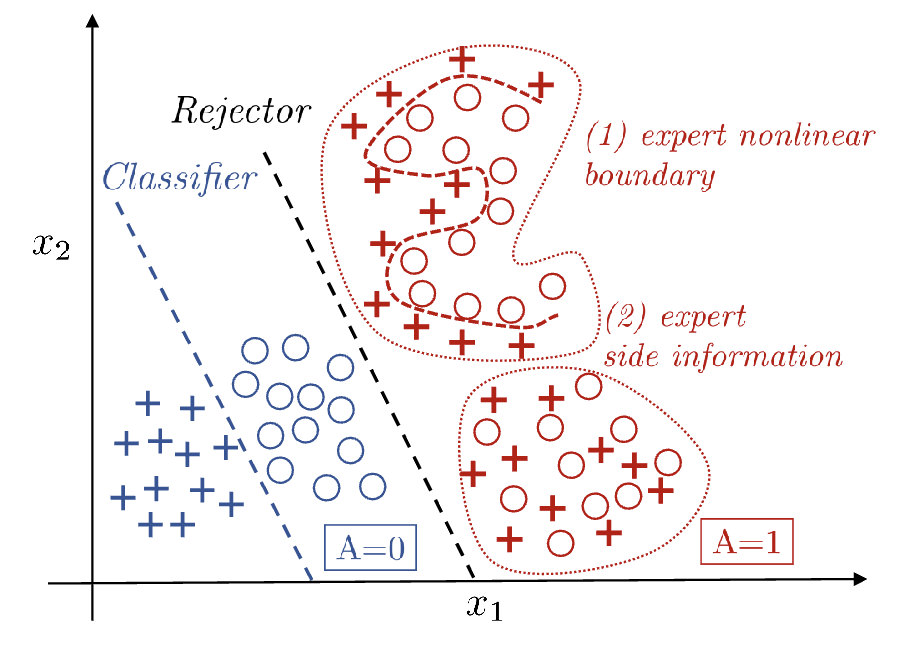

# Learning to defer

## Consistent Estimators for Learning to Defer to an Expert (2020)

[Link](https://proceedings.mlr.press/v119/mozannar20b/mozannar20b.pdf)

A natural system loss functionL for the system consisting of the classifier in conjunction with the expert:

\begin{equation}
\begin{aligned}
L(h,r) = 
\mathbb{E}_{(x,y)\sim P,\; m\sim M\mid(x,y)}
\Big[
l(x,y,h(x))\,\mathbb{I}_{r(x)=0}
+
l_{\mathrm{exp}}(x,y,m)\,\mathbb{I}_{r(x)=1}
\Big]
\end{aligned}
\end{equation}

We learn 2 separate functions $h$ and $r$.

Consistency is used to prove that a proposed surrogate loss is a good candidate. Optimize consistent loss function can approximate the minimizers of the original loss.

\begin{equation}\label{eq:surrogate}
\begin{aligned}
    &\tilde{L}_{CE}(g_1, \cdots, g_{K+1}, x, c(1), \cdots, c(K+1)) \\
    &= - \sum_{i=1}^{K+1} \left( \max_{j \in [K+1]} c(j) - c(i) \right)
    \log \left( \frac{\exp(g_i(x))}{\sum_k \exp(g_k(x))} \right)
\end{aligned}
\end{equation}

Equation \(\eqref{eq:surrogate}\) is a general surrogate loss for cost-sensitive learning. If cost are configured to match expert deferral setting (costs are the misclassification error with the target), the general loss in \(\eqref{eq:surrogate}\) can become \(\eqref{eq:surr-01loss}\)

\begin{equation}\label{eq:surr-01loss}
\begin{aligned}
&L_{CE}(h, r, x, y, m) \\ 
&= - \log \left( \frac{\exp(g_y(x))}{\sum_{y' \in \mathcal{Y} \cup \perp} \exp(g_{y'}(x))} \right) - \mathbb{1}_{m=y} \log \left( \frac{\exp(g_\perp(x))}{\sum_{y' \in \mathcal{Y} \cup \perp} \exp(g_{y'}(x))} \right)
\end{aligned}
\end{equation}

$c$ is the cost, $g$ is the confidence

The smaller $c(i)$ is, the better choice $i$ is

The minimizer of the surrogate loss above are defined point-wise for all $x\in\mathcal{X}$

A **modified loss** with $\alpha$:

\begin{equation}\label{eq:surr-01loss-with-alpha}
\begin{aligned}
&L_{CE}^\alpha(h, r, x, y, m) \\ 
&= -(\alpha \mathbb{I}_{m=y} + \mathbb{I}_{m \neq y}) \log \left( \frac{\exp(g_y(x))}{\sum_{y' \in \mathcal{Y} \cup \perp} \exp(g_{y'}(x))} \right) - \mathbb{I}_{m=y} \log \left( \frac{\exp(g_\perp(x))}{\sum_{y' \in \mathcal{Y} \cup \perp} \exp(g_{y'}(x))} \right)
\end{aligned}
\end{equation}

$\alpha$ is used to encourage the deferral

!!!note
    minimizer of a loss function is the value of parameters that makes the loss as small as possible. $\theta^* = \arg\min_{\theta} L(\theta)$

\[
\begin{aligned}
h^B(x) &= \arg\max_{y \in \mathcal{Y}} \eta_y(x), \\
r^B(x) &= \mathbb{I}_{\max_{y \in \mathcal{Y}} \eta_y(x) \leq \mathbb{P}(Y=M \mid X=x)}.
\end{aligned}
\]

### Experiment

#### Synthetic data generating process

features are drawn from class- and group-conditional Gaussians:

$$
X \mid Y=y, A=a \sim \mathcal{N}(\mu_{y,a}, \Sigma_{y,a})
$$

If $Y\in \{0, 1\}$, $A \in \{0, 1\}$, then there are 4 Gaussian components in total.

The expert **follows bayes solution for group $A=1$**. So the ideal system should learn the policy of defer on $A=1$ and predict with the model on $A=0$. 

**Oracle** — cheats with knowledge it shouldn't have: trains the classifier only on $A=0$ data and trains the rejector to separate the groups *using the true group labels*. This is the best you could do if you knew $A$ — an upper bound to aim at. (A is training target for rejector in oracle)

!!! note
    On A=1 the expert is Bayes-optimal, so no model can beat "always defer on A=1" *in expectation*. 
    
    Any real gain over the Oracle has to come from the A=0 region and from where the rejector boundary sits — exactly the spots where the Oracle's group-based heuristic is loose.

    The learned oracle baseline ignore **model** confidence entirely. In restricted model class with finite data, the model is not Bayes-optimal.

    Consider in CIFAR-10 experiment, on the first \(k\) classes, expert correctness $= 1 \ge \max_y \eta_y(x)$ so optimal is defer. On the rest, however, expert correctness $\le 1/10$. TheBayes-optimal model will beats that, but with limited data, the model may not be Bayes-model.

MoE loss fails by learning to _never defer_. 

MoE setting is use 2 rejectors $r_i: \mathcal{X} \rightarrow \mathbb{R}$ for $i\in \{0,1\}$ and $r(x) = \arg\max_{i\in\{0,1\}} r_i(x)$.

It's a soft weighted average of 2 costs: classifier's cross-entropy loss and expert's 0-1 indicator loss.

During training, the classifier fits the training data so the cross-entropy loss $\ell_{CE}$ is pushed towards 0 (though validation accuracy is still climbing). Meanwhile the expert's $\mathbb{I}_{m\neq y}$ never moves. The rejector is trained against the training set cross-entropy, which has collapsed to 0.

#### CIFAR-10

- It is not about reaching higher accuracy but showing our proposed loss has merit for a given fixed model structure (fix the capacity and inductive biases of the model, then ask "does the loss recover the right deferral policy?" That's an orthogonal question from "what if we used a bigger network or better features?")
- Identical result, whether we
    - parameterize $h$ and $r$ (specifically $g_{\perp}$) by a WideResNet with 11 output units where the first 10 units represent $h$ and the 11th unit is $g_\perp$ and minimize the proposed surrogate $\mathcal{L}_{CE}^\alpha$
    - have $h$ be a WideResNet with 10 output units and $g_{\perp}$ a WideResNet with a single output unit

