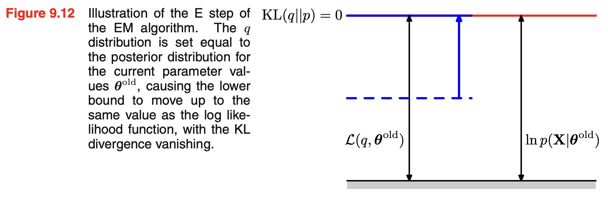
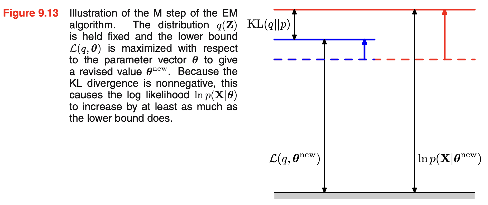

# Chapter 9: Mixture Models and EM

## 9.1. K-means clustering

an assignment of data points to clusters as well as a set of vector $\{\mu_k\}$.

The sume of the squares of the distance of each data points to its closest vector $\mu_k$ is a minimum.

1-of-K coding scheme

$$
r_{nk} = 
\begin{cases}
1 & \text{ if } k = \operatorname{arg\min}_j \|\mathbf{x}_n - \boldsymbol{\mu}_j\|^2 \\ 
0 & \text{ otherwise.}
\end{cases}
$$

distortion measure 

$$J = \sum_{n=1}^N \sum_{k=1}^K r_{nk} ||x_n - \mu_k||^2$$

from 9.3.3 (9.43) will see that minimizing this distortion measure $J$ is equivalent to maximizing the log likelihood of complete-data.

| K-means | EM | step |
|------------------|-------------------|--|
| update $r_{n,k}$ | E expectation step | take 1 if k is min |
| update $\mu_k$   | M maximization step| mean of points assigned to k |

It may converge to a local rather tha global minimum of J


K-medoids

$$J=\sum_{n,k} r_{nk} V(x_n,\mu_k)$$

Instead of allowing $\mu_k$ to be any point in space, K-medoids restricts $\mu_k \in \{x_1,\dots,x_N\}$

More specifically, each prototype must be one of the data points assigned to the cluster.

That representative data point is called the medoid.

So unlike:

- K-means → prototype = average point
- K-medoids → prototype = actual data point

now optimization becomes a finite search problem with $O(N_k^2)$ complexity


## 9.2. Mixture of Gaussians

$$
    \gamma(z_k) = \frac{\pi_k \mathcal{N}(\mathbf{x} \mid \boldsymbol{\mu}_k, \boldsymbol{\Sigma}_k)}{\displaystyle \sum_{j=1}^{K} \pi_j \mathcal{N}(\mathbf{x} \mid \boldsymbol{\mu}_j, \boldsymbol{\Sigma}_j)}
$$

$\gamma(zk)$ is the corresponding **posterior** probability once we have observed $x$. 
As we shall see later, $\gamma(zk)$ can also be viewed as the responsibility that component $k$ takes for ‘explaining’ the observation $x$.

In the expectation step, or **E step**, we use the current values for the parameters to evaluate the posterior probabilities, or responsibilities $\gamma$

We then use these probabilities in the maximization step, or **M step**, to re-estimate the means, covariances, and mixing coefficients using the results (9.17), (9.19), and (9.22)

9.17:

$$\boldsymbol{\mu}_k = \frac{1}{N_k} \sum_{n=1}^N \gamma(z_{nk})\mathbf{x}_n$$

9.19:

$$
\boldsymbol{\Sigma}_k = \frac{1}{N_k} \sum_{n=1}^N \gamma(z_{nk})(\mathbf{x}_n - \boldsymbol{\mu}_k)(\mathbf{x}_n - \boldsymbol{\mu}_k)^\mathrm{T}
$$

9.22:

$$\pi_k = \frac{N_k}{N}$$

There will generally be multiple local maxima of the log likelihood function, and that EM is not guaranteed to find the largest of these maxima.


## 9.3. An alternative view of EM

E step: $\mathcal{Q}(\theta, \theta^{\mathrm{old}}) = \sum_z p(Z \mid X,\theta^{\mathrm{old}}) \ln p(X,Z \mid \theta)$

M step: $\theta^{\mathrm{new}} = \mathrm{argmax}_{\theta} \mathcal{Q}(\theta, \theta^{\mathrm{old}})$

### 9.3.1 Gaussian mixtures revisited

Complete data

\begin{equation}
    \ln p(\mathbf{X}, \mathbf{Z} \mid \boldsymbol{\mu}, \boldsymbol{\Sigma}, \boldsymbol{\pi})
    = \sum_{n=1}^{N} \sum_{k=1}^{K} z_{nk} \left\{ \ln \pi_k + \ln \mathcal{N}(\mathbf{x}_n \mid \boldsymbol{\mu}_k, \boldsymbol{\Sigma}_k) \right\}
\end{equation}

Incomplete data

\begin{equation}
    \ln p(\mathbf{X} \mid \boldsymbol{\pi}, \boldsymbol{\mu}, \boldsymbol{\Sigma})
    = \sum_{n=1}^{N} \ln \left\{ \sum_{k=1}^{K} \pi_k \mathcal{N}\bigl(\mathbf{x}_n \mid \boldsymbol{\mu}_k, \boldsymbol{\Sigma}_k\bigr) \right\}.
\end{equation}

Note $z_n$ is a K-dimensional one-hot vector. The complete-data log liklihood function is a sum of K independent contributions, one for each mixture component

### 9.3.2. Relation to K-means

K-means perform hard assignment of data points to clusters, while EM makes soft assignment based on posterior probability. 

## 9.4. EM in general

$$
\ln p(X\mid \theta) = \mathcal{L}(q,\theta) + KL(q\| p)
$$

\begin{equation}
\log p(x) = \underbrace{\int q(z) \log \left\{ \frac{p(x,z)}{q(z)} \right\} dZ}_{\mathcal{L}(q)}\underbrace{-\int q(z) \left\{ \frac{p(z\mid x)}{q(z)} \right\} dz}_{D_{KL}(q \| p(z \mid x))}
\end{equation}

!!! note
    $D_{KL}$ is minused

$KL(q\| p)$ is the Jullback-Leibler divergence between $q(Z)$ and posterior $p(Z\mid X,\theta)$




### EM in MAP

```latex
\begin{aligned}
\ln p(\theta \mid x) &= \ln p(\theta, x) - \ln p(x) \\
&= \ln p(x \mid \theta) + \ln p(\theta) - \ln p(x) \\
&= \mathcal{L}(q,\theta) + KL(q\| p) + \ln p(\theta) - \ln p(x) \\
&\ge \mathcal{L}(q,\theta) + \ln p(\theta) - \ln p(x)
\end{aligned}
```


